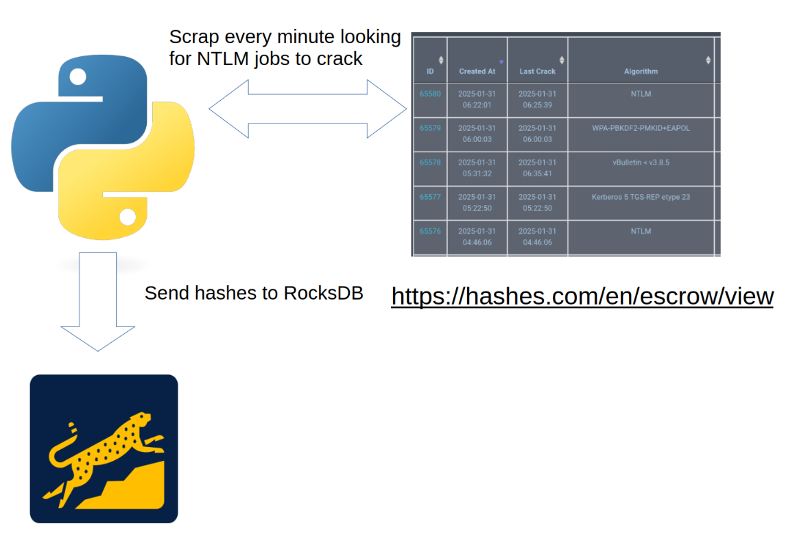
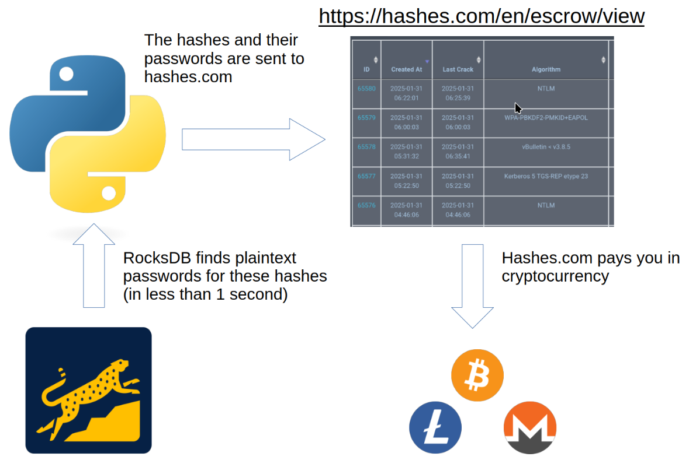

# cash_ntlm

Cash NTLM is a project that allows you to generate between $1 and $3 per week in cash (cryptocurrency) by breaking NTLM hashes sent to hashes.com.

The hashes are broken almost instantaneously (within 10 seconds for text files containing several hundred thousand NTLM hashes) using a dictionary attack stored with rocksdb.

## Step 1

## Step 2

## rocksdb

To create the rocksdb database, insert hash:clearpassword pairs into it from a text file, query a hash or a file with many hashes (1 per line).

`g++ import_to_rocksdb.cpp -o import_to_rocksdb -lrocksdb -lsnappy -lz -lbz2 -llz4 -lzstd -lpthread`

`g++ query_rocksdb.cpp -o query_rocksdb -lrocksdb -lsnappy -lz -lbz2 -llz4 -lzstd -lpthread`

`g++ multiget_rocksdb.cpp -o multiget_rocksdb -lrocksdb -lsnappy -lz -lbz2 -llz4 -lzstd -lpthread`

## discord_monitor_hashescom

Bot that scrapes every minute looking for new NTLM hash jobs to crack (you can also crack MD5s in dico if you want to make more cash) and sends the information to a discord channel (via webhook).

## generate_ntlm_dico_rust

Rust script to generate full-character dictionaries of the desired size (beware: this can quickly take up a lot of storage space).

## ntlmpw

For the huge rats who don't want to show off their own dictionaries but scrape the ntlm.pw site with residential proxies.